# End-to-End Workflow

## Document purpose

Describe the approved phase and milestone flow without assigning direct side effects to Web routes or agents.

## In-scope responsibilities

```mermaid
flowchart LR
  P[Planner] --> F[Feasibility Assessor]
  F --> A1[Approval 1]
  A1 --> C[Codex]
  C --> V[Verifier]
  V -->|PASSED| R[Reviewer]
  V -->|FAILED, max 3 fixes| C
  R -->|NEEDS_FIX, max 3 fixes| C
  R -->|BLOCKED or NEEDS_HUMAN_DECISION| HD[Human-decision stop]
  R -->|APPROVED| H[Handoff Agent]
  H --> I[Implementation commit]
  I --> HF[Handoff Finalizer]
  HF --> G[Handoff-finalization commit and source push]
  G --> S[SOURCE_COMPLETED]
  S --> K[Knowledge Curator proposal artifact]
  K --> A2[Approval 2]
  A2 --> W[Vault Writer, verify, commit, push]
  W --> X[COMPLETED]
```

### Phase workflow

1. A Phase Contract is drafted.
2. Phase Start Approval authorizes creation and initial push of the approved phase branch.
3. Panam creates the phase branch and marks the phase ACTIVE.
4. Approved Milestone Contracts execute sequentially on that branch.
5. At phase end, Panam performs final regression verification and prepares a Phase Merge Package.
6. Panam prepares the Phase Merge Package automatically. After Matej explicitly confirms Pull Request creation, Panam may technically create the Pull Request. Panam never approves or merges it; merge remains human-controlled.

### Development Run workflow

1. Planner and Feasibility Assessor produce evidence for the Milestone Contract.
2. Approval 1 authorizes implementation, verification, up to three focused fixes, the two source commits, and their push.
3. Codex implements; Verifier gathers deterministic evidence; Reviewer returns a decision.
4. A NEEDS_FIX decision permits a focused fix that preserves the original Milestone Contract. After three failed focused fixes, the run is BLOCKED.
5. After Verifier PASSED, Reviewer APPROVED, and policy success, the Handoff Agent creates the draft handoff with the implementation-commit field Pending.
6. Panam creates implementation commit 1 containing implementation, tests, approved repository documentation, and the handoff draft. The Handoff Finalizer then inserts commit 1's real hash, finalizes evidence and next expected step, and prepares the handoff-only change for handoff-finalization commit 2. Panam pushes both to the approved phase branch.
7. The run reaches SOURCE_COMPLETED. Knowledge Curator creates a runtime-artifact proposal, not a source-repository proposal file.
8. Approval 2 authorizes only that exact proposal and named Vault paths. Vault changes are verified, committed, and pushed before COMPLETED.

## Approved decisions

SOURCE_COMPLETED is a durable source-side checkpoint: source code, handoff, both source commits, and source push are complete. COMPLETED additionally requires approved and pushed Vault changes. CLOSED_WITHOUT_VAULT is a terminal milestone outcome requiring Matej's explicit decision after source completion.

## Explicit boundaries and out of scope

There is no automatic PR approval, merge, branch deletion, or next-milestone start. Long-running operations never execute inside Flask request handlers.

## Cross-references

- [State machine](03-state-machine.md)
- [Handoff and Git policy](05-safety-git-approval-policy.md)
- [Human interaction model](09-human-interaction-model.md)

## Future considerations

The Phase Merge Package is a v1 output; branch integration remains human-controlled.
