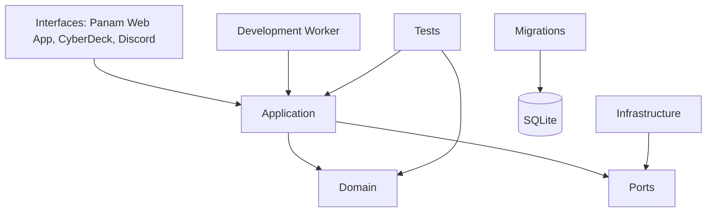

# Modular Architecture

## Document purpose

Specify the Development Loop's modular-monolith boundary within Panam_APP and its separate Development Worker process.

## In-scope responsibilities

Primary layers:

- **domain**: contracts, policies, state-transition rules, and value objects.
- **application**: use cases, command handling, orchestration, and transition requests.
- **ports**: transport-independent interfaces for storage, Git, subprocesses, Codex, OpenAI roles, artifacts, and Vault work.
- **infrastructure**: SQLite, filesystem, Git, process, OpenAI, Codex, and Vault implementations of ports.
- **interfaces**: Panam Web App, CyberDeck, and Discord adapters.
- **migrations**: durable SQLite evolution.
- **tests**: deterministic unit, integration, policy, and recovery tests.

Dependency direction is `interfaces → application → domain`; infrastructure implements ports. The domain must not know Flask, Discord, SQLite, Git, OpenAI, Codex, subprocesses, or `Vault_work`.

## Approved decisions

The Panam Web App is the workflow cockpit. CyberDeck is technical operations. Discord only notifies and exposes brief status. The Development Worker is separate from the Web process and uses the durable command queue.

## Explicit boundaries and out of scope

No shared orchestration logic belongs in Flask route functions, Discord handlers, or CyberDeck templates. Long-running work never runs inside Flask requests.

## Cross-references

- [Actors and responsibilities](01-actors-and-responsibilities.md)
- [Core data model](04-core-data-model.md)
- [API and agent contracts](08-api-agent-contracts.md)

## Future considerations

The modular monolith may later be separated into a service without changing the domain or port contracts.
