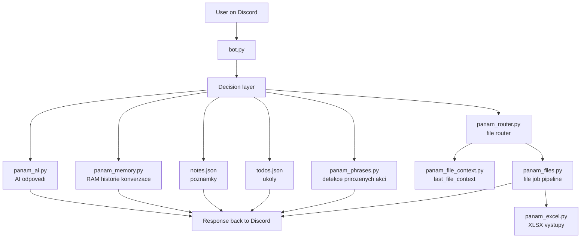
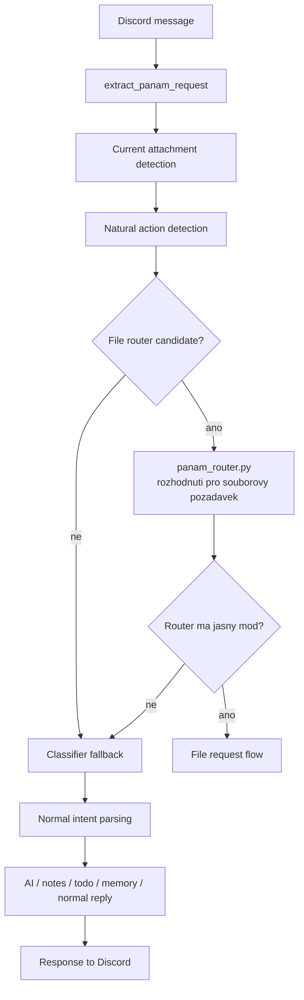
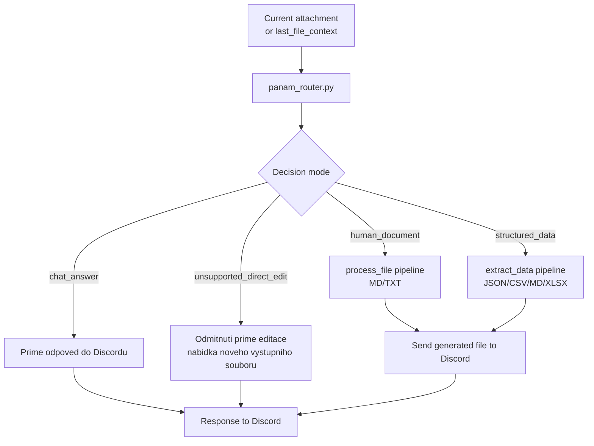
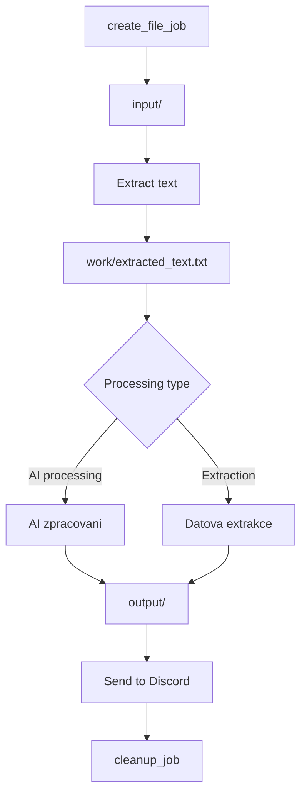
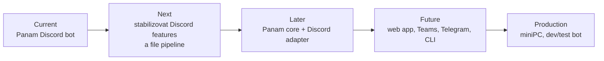

# Panam flow v1

Tenhle dokument mapuje, jak dneska prochazi pozadavky aktualni codebase Panam Discord bota. Neni to refactor plan ani navrh nove architektury. Je to prakticka mapa soucasneho provozu: kudy tece zprava, kde se rozhoduje, kdy se zapina AI, pamet, poznamky, todo a souborovy pipeline.

Ber to jako servisni schematko nomadskeho auta: nepopisuje, jak ho prestavet na tank, ale kde jsou kabely, rele a trubky, kdyz potrebujes rychle pochopit tok.

## High-level architecture

Hlavni vstupni bod je `bot.py`. Ten drzi Discord eventy, sklada kontext zpravy a posila pozadavek do rozhodovaci vrstvy. Rozhodovaci vrstva neni jeden izolovany modul, ale kombinace logiky v `bot.py`, `panam_router.py`, `panam_phrases.py`, `panam_file_context.py` a navazanych helperu.

Souborove veci obsluhuji hlavne `panam_router.py`, `panam_files.py`, `panam_excel.py` a `panam_file_context.py`. Konverzacni odpovedi a AI zpracovani jdou pres `panam_ai.py`. Kratka pamet kanalu je v `panam_memory.py`. Jednoducha persistentni data jsou oddelene v `notes.json` a `todos.json`.

## Natural message flow

Pri prirozene zprave se nejdriv vytahne skutecny Panam request z Discord zpravy. Pak se resi, jestli je k dispozici aktualni priloha. Nasleduje detekce prirozenych akci, treba jestli uzivatel chce soubor shrnout, prevest, vytahnout data nebo jen normalne odpovedet.

Pokud zprava vypada jako kandidat na souborovy pozadavek, dostane prostor router. Kdyz router nerozhodne dostatecne jasne, tok spadne zpatky do bezneho classifier/intentu. Cilem je, aby bezna konverzace zustala prirozena a souborove prikazy se zachytily jen tehdy, kdyz opravdu davaji smysl.

## File request flow

`chat_answer` znamena, ze Panam odpovi primo do Discordu a nevyrabi novy soubor.

`human_document` vytvari citelny dokumentovy vystup, typicky MD nebo TXT, pres `process_file` pipeline.

`structured_data` vytvari strukturovany vystup, typicky JSON, CSV, MD nebo XLSX, pres `extract_data` pipeline.

`unsupported_direct_edit` je ochranny rezim. Panam neprepisuje originalni Discord prilohu primo. Misto toho odmitne prime upravy puvodniho souboru a nabidne vytvoreni noveho vystupniho souboru.

## File job pipeline

Souborovy job vytvori izolovane runtime prostredi pro konkretni pozadavek. Priloha se ulozi do `input/`, text se vytahne do `work/extracted_text.txt` a nad tim pak bezi AI zpracovani nebo datova extrakce. Vystupy se ukladaji do `output/`, poslou se zpet do Discordu a potom se job uklidi pres `cleanup_job`.

Originalni Discord attachment se nikdy needituje primo. Panam pracuje kopii ve file jobu a vysledkem je odpoved nebo novy vystupni soubor.

## Memory and context

`panam_memory.py` drzi kratkou RAM historii konverzace per channel. Je to runtime kontext pro prirozenejsi odpovedi, ne dlouhodoba databaze pravdy.

`panam_file_context.py` drzi `last_file_context`, volitelny bezpecny `file_summary` a `last_router_decision`. To pomaha navazovat na predchozi prilozeny soubor, kdyz uzivatel pise treba "udel z toho tabulku" bez nove prilohy.

`notes.json` a `todos.json` jsou oddelene persistentni jednoduche datove soubory. Slouzi pro poznamky a ukoly, ne pro obecnou konverzacni pamet ani file pipeline.

`runtime/jobs` a `logs` nejsou source of truth. Jsou to provozni stopy: docasne joby, mezivystupy, logovani a diagnostika.

## Future direction

Aktualni stav je Panam Discord bot. Nejblizsi smer je stabilizovat Discord features a souborovy pipeline, aby normalni chat, poznamky, ukoly a prace se soubory byly predvidatelne.

Pozdeji dava smysl oddelit Panam core od Discord adapteru. Core by nesl osobnost, rozhodovani, pametove rozhrani a file schopnosti. Discord by byl jen jeden z adapteru.

Budouci smer muze pridat web app, Teams, Telegram, CLI, produkcni beh na miniPC a oddeleny dev/test bot. Tohle uz je mapa dalnice za Night City, ne zmena v tomhle dokumentu.
